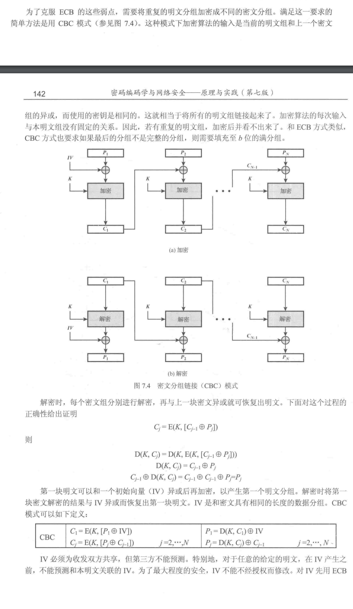

# CryptoVerse CTF 2023

## 前言

好歹是找到了工作，所以决心回到 Crypto 的学习中，这一次决计不可以松懈了，学习最重要的就是坚持。

不过由于我还是在山海关的子队里面，所以每日还是要做一个 web 题。

### Baby AES-密钥空间过小

flag 采用 CBC 模式进行 AES 加密，并且告知了 IV 和 CT。

我们去看看 CBC 是如何加密的：



从上图可以看到第一组明文需要先和 IV 异或后再作为加密算法的输入，得到的结果是 C1。

解密的时候各组是分别解密的，所以单独知道 IV 和 所有密文分组，我们也没办法解密任何一组明文，因为我们必须首先用密钥解密当前密文分组，然后再和 IV 或上一组密文分组异或。

这个题目真正的问题在于密钥太小了，只有两个字节。题目的密钥生成过程可以概括如下：

1. 生成两个字节的随机字符串
2. 填充到 AES 的密钥长度

密钥这么小，当然可以进行爆破，剩下的问题是如何验证我们爆破到了正确的密钥呢？

我们可以利用明文的开头是 `cvctf{` 来进行验证，只要解密的时候出现了该字符就可以认为爆破出了正确的密钥。

爆破脚本如下：

```python
from Crypto.Cipher import AES
from Crypto.Util.Padding import pad
import itertools
ct = bytes.fromhex('a40c6502436e3a21dd63c1553e4816967a75dfc0c7b90328f00af93f0094ed62')
iv = bytes.fromhex('1df49bc50bc2432bd336b4609f2104f7')
target_plaintext = b'cvctf{'  # The plaintext you want to find
for key in itertools.product(range(256), repeat=2): # 一个字节取值 0-255，两字节爆破作笛卡尔积
    key = bytes(key)
    cipher = AES.new(pad(key,16), AES.MODE_CBC, iv)
    pt = cipher.decrypt(ct)
    if pt.find(target_plaintext) != -1 :
        print(f"Found key: {key.hex()}")
        break
else:
    print("Key not found.")
```


### LFSR Explorer

```python
from Crypto.Util.number import *
from secret import flag

assert flag.startswith("cvctf{")
assert flag.endswith("}")

flag = flag[6:-1].encode()
assert len(flag) == 8

def explore(state, mask):
    curr = (state << 1) & 0xffffffff # 将 state 乘以 2，然后保留最低 4 字节
    i = state & mask & 0xffffffff # state 掩码按位与
    last = 0
    '''
    while 循环依次遍历 i 的最低位到最高位，所以 last 实质上是 i 的二进制表示中取值为 1 的那些位的 异或
    '''
    while i != 0:
        last ^= (i & 1)
        i >>= 1
    curr ^= last # curr 最低位的零 变为 last 的值，若 i 有奇数个 1，那么 last 值为1，即 curr最低位为1
    return (curr, last)

states = [bytes_to_long(flag[4:]), bytes_to_long(flag[:4])]
mask = 0b10000100010010001000100000010101

output = []
for i in range(8):
    tmp = 0
    for j in range(8):
        (states[i // 4], out) = explore(states[i // 4], mask) # states 总长是2，那么 i=0-4 时都取 states[0]，5-7 取 states[1]
        tmp = (tmp << 1) ^ out
    output.append(tmp) # tmp 的二进制表示蕴含着 lsfr 的输出是什么，这一点很重要。

with open("output.txt", "wb") as f:
    f.write(bytes(output))

```

我们的目标就是恢复出原始的 stats 数组。

现在我们分析一下这个 lfsr 的反馈函数是什么：


