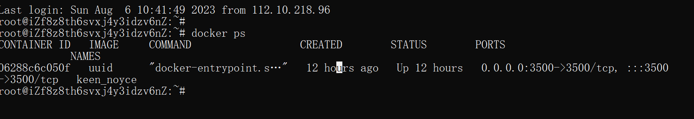

# ImaginaryCTF

### Crypto

#### rsa

考点：

1. 了解rsa加解密原理，了解rsa公私钥的组成。
2. 了解如何打开pem和enc文件，并知晓如何解密enc。

```
from Crypto.PublicKey import RSA
from Crypto.Util.number import bytes_to_long, long_to_bytes

with open("private.pem","rb") as key_file:
    prik = RSA.import_key(key_file.read())

with open("public.pem","rb") as key_file:
    pubk = RSA.import_key(key_file.read())

with open("flag.enc","rb") as c_file:
    c = bytes_to_long(c_file.read())

n,d=pubk.n,prik.d
m = pow(c,d,n)
print(long_to_bytes(m))
```

**emoticons**&#x20;

**考点：**

1. **知晓替换密码的概念、原理、性质。**
2. **熟悉针对替换密码的频率分析攻击，并可以实践。**

典型的替换密码，原文应该是英文文本串，但是题目把它变成了十六进制字符串，然后用emojis一一替换这些十六进制字符。

可以用频率分析法破解这个替换密码。可以这么去考虑：密文中的emojis字符出现的频率和原文十六进制字符出现的频率是一致的。我们可以预估出原文中各个十六进制字符出现的频率，然后将这个频率和密文emojis字符的频率进行对应并进行替换。不过可惜的是，这样求出来的结果最后误差会有些大，但是通过[qiupquip](https://www.quipqiup.com/)可以帮我们修正一下。


```python
from binascii import hexlify

f = open('out.txt', 'r',encoding='utf-8')
line = f.read().rstrip()
f.close()

sorted_freqs = [18.28846265, 10.26665037, 7.51699827, 6.53216702, 6.15957725, 5.71201113, 5.66844326, 5.31700534, 4.98790855, 4.97856396, 3.31754796, 3.28292310, 2.27579536, 2.23367596, 2.02656783, 1.98306716, 1.70389377, 1.62490441, 1.50432428, 1.42766662, 1.25888074, 0.79611644, 0.56096272, 0.14092016, 0.09752181, 0.08367550, 0.05128469]
sorted_chars = [' ', 'e', 't', 'a', 'o', 'n', 'i', 's', 'r', 'h', 'l', 'd', 'u','c', 'm', 'f', 'w', 'g', 'p', 'y', 'b', 'v', 'k', 'x', 'j', 'q', 'z']
num_chars = {}
hex_freqs = {}

assert(len(line) % 2 == 0)
msg_len = len(line) // 2


test_hex_str = ''
for freq, char in zip(sorted_freqs, sorted_chars): # 计算每个字符在加密消息中的预估出现次数。
    num_chars[char] = int(msg_len * (freq / 100.0))
    test_hex_str += num_chars[char] * hexlify(char.encode()).decode().zfill(2)

est_freqs = {}
for c in test_hex_str:
    if c not in est_freqs:
        est_freqs[c] = 1
    else:
        est_freqs[c] += 1

# Sort the dictionary by values
# Then, extract the sorted keys and values into separate lists
sorted_est_freqs = sorted(est_freqs.items(), key=lambda item: item[1])
sorted_est_keys = [item[0] for item in sorted_est_freqs]
sorted_est_values = [item[1] for item in sorted_est_freqs]

act_freqs = {}
for c in line:
    if c not in act_freqs:
        act_freqs[c] = 1
    else:
        act_freqs[c] += 1

# Sort the dictionary by values
# Then, extract the sorted keys and values into separate lists
sorted_act_freqs = sorted(act_freqs.items(), key=lambda item: item[1])
sorted_act_keys = [item[0] for item in sorted_act_freqs]
sorted_act_values = [item[1] for item in sorted_act_freqs]

m = line
for e, c in zip(sorted_act_keys, sorted_est_keys):
    m = m.replace(e, c)

print(bytes.fromhex(m).decode('utf-8'))
```

#### signer



考点：

1. 熟悉[CRC32](https://ceng2.ktu.edu.tr/\~cevhers/ders\_materyal/bil311\_bilgisayar\_mimarisi/supplementary\_docs/crc\_algorithms.pdf)的原理与概念，知晓如何求CRC32的逆。
2. 知晓模乘可结合的性质。
3. 知道应将PASSWORD的CRC32值拆分。

更加具体的解题思路可以参看此处：[https://meashiri.github.io/ctf-writeups/posts/202307-imaginaryctf/](https://meashiri.github.io/ctf-writeups/posts/202307-imaginaryctf/)




**Tan**

Description

`tan(x)` is a broken hash function in terms of collision resistance and second preimage resistance. But you surely can't find the preimage of `tan(flag)`, right?



