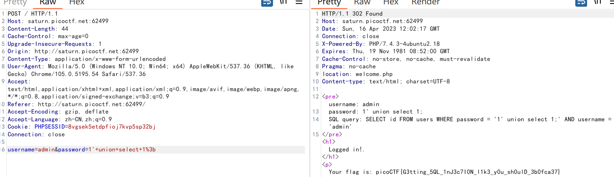

###### tags: `CTF`

# PicoCTF 2023-Web

## 前言

PicoCTF 是卡内基梅隆大学举办的一个CTF比赛，挺好玩的。

- [题目地址](https://play.picoctf.org/practice?category=1&originalEvent=72&page=1)
- [官方discord](https://discord.com/channels/575006934089072650/960896102427656263)

## findme

抓包，前半部分Cookie在响应头处，后半部分登录看网页源码。

## MatchTheRegex

注意到网页源码中的 ^p....F，提示我们以p开头，以F结尾。这不就是picoCTF吗？尝试一下果然得到了flag。

## SOAP

经典的[XML外部实体注入](https://xz.aliyun.com/t/3357)，读取/etc/passwd文件即可。注意元素的名字要和题目的一样，分别是data和ID。

## More SQLi

题目提示是SQLiLite，网上搜索几篇文章学习一下SQLiLite注入。我看的是[先知社区](https://xz.aliyun.com/t/8627)的这一篇，讲的很不错。

题目似乎是只要返回了数据就弹出flag：

```
username=admin&password=1'+union+select+1%3b
```



## Java Code Analysis!?!

考点-JWT鉴权，题目限定了只有管理员才可以读取flag的book。

由于JWT的密钥硬编码在了源码里面，所以可以直接伪造管理员的JWT。

>也可以使用工具破解


## cancri-sp

这个题目为什么有1GB的源码？在干什么...

## msfroggenerator2


## 参考链接

- https://blog.maple3142.net/2023/03/29/picoctf-2023-writeups/

- https://c0nfl1c7.github.io/posts/2023/03/picoctf-2023-web/java-code-analysis/

- https://github.com/BlackAnon22/BlackAnon22.github.io/blob/main/posts/CTF%20Competitions/picoCTF_2023.md