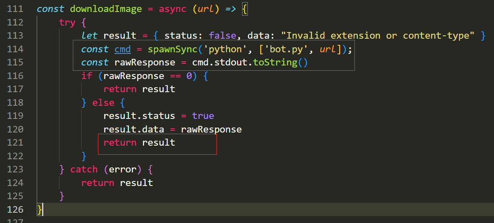
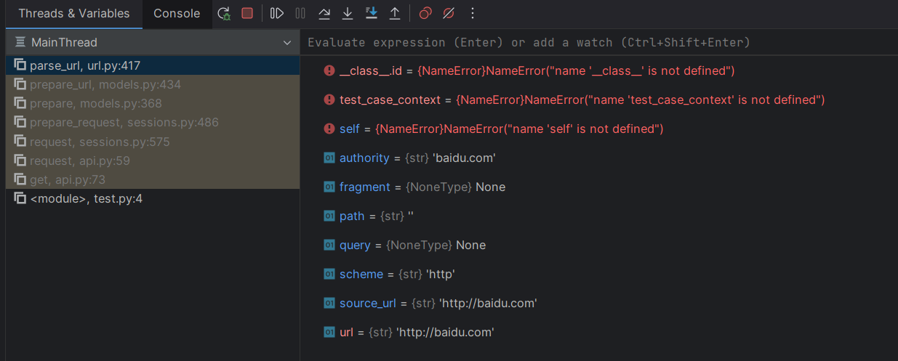

# TetCTF 2023

## 前言

每年过年越南似乎都会举办一场ctf比赛，这也是ctftime上2023年的第一场ctf比赛。

源码：https://drive.google.com/file/d/13QLDDnauyMogu8RX-xLqB8jP-degF28d/view

## WEB

### NewYearBot

**题目描述**

**Description**
New Year New Code! My friend decide to learn code in new year, here his very first website: http://172.105.120.180:9999/

**File**
He said it is very secure because he is very strict on what user can input, can you check?
https://drive.google.com/file/d/1tU18ePUAHHYpxJ9QhdVKBpuBm_eXy--r/view?usp=sharing

**Note**
Don't generate excessive load. Scanning/Dirbust is not needed.

#### 题目分析

这是一个传入type和number然后回显对应的问候语的应用。type用于选择特定的问候语列表，number选择列表中的元素。一番审计感觉应该是下面这个地方的代码有问题：


对于传入的type仅做了一个变量名是否合法的校验，这里或许可能执行任意的函数，而非是题目期望的问候语列表。

flag是在FL4G这个变量里面，所以很自然的想法就是显示该变量的内容。如果传入的type为FL4G，那么肯定希望number是对应的下标索引。但是number有一个botValidator函数过滤，该函数限制了number各个字符的ascii值不可以在57-123之内，并且数字部分总长度不可以超过最长的问候语列表的长度。（最大长度是 6）那么我们传入的 number 必须小于等于 5 。所以如何截取剩余的flag字符呢？我看到的有两种手法：

**slice切片结合同型字符**

python的 [slice](https://www.runoob.com/python/python-func-slice.html) 

我们只要得到一个截取很多个元素的切片 myslice，然后通过 FL4G[myslice] 不就可以截取出 flag 来了么？只要截取元素够多，就可以拿到完整的 flag。

要调用 slice 函数，我们需要得到一个整数，在 python 下，id 函数用于获取对象的唯一标识符，而标识符是一个整数，所以我们可以通过 slice(id(对象)) 来得到一个元素切片。而这个对象我们有很多种选择，比如在题目源码中导入的几个模块 re、random等，不过长度尽量短，因为我们传入的 number 参数是有长度限制的。例如我们可以选择 `number=slice(id(re))`

但是还有一个很关键的问题，那就是题目不允许我们传入 ascii 码值在 57 和 123 之间的字符

我们可以通过传入 `slice(id(re))` 的 **unicode 同形字符**来绕过这个限制，尽管说这些并不是 ascii 字符，但是 python 会自动 normalize 它们。[同形字符](https://www.freebuf.com/vuls/229446.html) 𝔰𝔩𝔦𝔠𝔢(𝔦𝔡(𝔯𝔢))


**位运算**

[Python Bitwise Operators](https://www.w3schools.com/python/gloss_python_bitwise_operators.asp)

`~` 是 python 中的 取反运算符。

`-~5` 会得到 `6` ，关于其底层原理，可以看这篇文章：[取反运算符~详解](https://zhuanlan.zhihu.com/p/261080329)。而减号和波浪号是在允许的 ascii 码值范围内，所以我们可以通过这种手法拿到 flag 的第六个字符

```
type=FL4G&number=𝔰𝔩𝔦𝔠𝔢(𝔦𝔡(𝔯𝔢)) # POST
```

```
-~0-~4 -> 6
-~0-~5 -> 7
-~0-~0-~5 -> 8
-~0-~0-~0-~5 -> 9
(-~0-~0)*5 -> 10
~0-(-~0-~0)*~5 -> 11
(-~0-~0-~0)*4 -> 12
~0-(-~0-~0)*5 -> -11
(-~0-~0)*~4 -> -10
~(-~0-~0)*3 -> -9
(-~0-~0)*~3 -> -8
~0--~5 -> -7
~5 -> -6
~4 -> -5
~3 -> -4
~2 -> -3
~1 -> -2
~0 -> -1
```


### Image Services Viewer

**题目描述**

Do you know secret which on my server!!!!

源码地址：https://drive.google.com/file/d/1K8XJXrdwEgJWGwu2V3cqLiZUo4nrdweM/view?usp=share_link

#### 题目分析

**环境搭建**

- 根据readme.md的指示来，不过给的Dockerfile在下载镜像时会有网络问题，经过我的尝试似乎怎么换源都不行，建议安装v2rary翻墙。然后 adminPortal里面jdk的下载链接失效了，这里给出一个[国内的](https://blog.lupf.cn/articles/2022/02/19/1645283454543.html)，大家可以自行下载到本地然后用copy命令复制到容器里面。我最后修改成如下的样子了：

  ```dockerfile
  # 前面都一样
  COPY ./jdk-7u80-linux-x64.tar.gz jdk-7u80.tgz
  RUN \
    mkdir -p /opt/jdk/$JDK_VERSION && \
    tar -zxf $JDK_VERSION.tgz -C /opt/jdk/$JDK_VERSION --strip-components 1 && \
    rm $JDK_VERSION.tgz && \
    update-alternatives --install /usr/bin/java java /opt/jdk/$JDK_VERSION/bin/java 100 && \
    update-alternatives --install /usr/bin/javac javac /opt/jdk/$JDK_VERSION/bin/javac 100 && \
    update-alternatives --install /usr/bin/jar jar /opt/jdk/$JDK_VERSION/bin/jar 100
  
  
  # 后面都一样
  
  ```

  话不多说，开始分析题目，首先是源码目录结构如下图所示：


三个目录以及docker的yaml还有两个启动脚本，官方说了有两个题是同一个附件，分别有两个flag。根据现在的题目名明显我们需要关注 images-services 这个目录。

首先观察一下该目录的 dockerfile，因为这能让我了解题目的基本业务逻辑。

```dockerfile
COPY ./container/images-services/flag.txt /usr/src/app/fl4gg_tetCTF

EXPOSE 3000

CMD [ "node", "index.js" ]
```

flag在容器当前工作目录下的fl4gg_tetCTF，入口文件是 index.js。那现在就去看一下这个文件。看完这个文件后，感觉有问题的点在于：


此处题目已经暗示我们url和flag有关系了，又是host、又是url的，很容易让人想起SSRF，我的首要想法是通过SSRF读取服务端本地的flag。但是还是要看看downloadImage()函数做了什么。



以我们传入的url为参数执行命令

```python
python bot.py url
```

现在跟进去看看bot.py，注释告诉我们这是一个处理本地请求的文件，可以接受 file:// 这样的url。看到这里很自然的想法就是利用 fie 协议读取 flag。然而，题目利用了好几个函数对请求进行了过滤的，所以必须观察利用file协议读flag会不会触发过滤函数。

- `isAdmin()` 要求password=Th!sIsS3xreT0但是长度又不能超过12，将password改成数组传入即可。

```
password[]=Th!sIsS3xreT0
```


- `valite()`要求请求体的值的类型必须是String或Number，同时值不可以包含一些黑名单字符，看了一眼没有file://以及和flag路径相关的，非常nice！

- `IsValidProtocol()` 结合源码要求url只能是http或者https。很难搞，似乎无法用fie协议了？
- `isValidHost()`限制host必须是i.ibb.co
- bot.py请求的时候要求后缀名是图片、响应的Content-Type是image，第一个我想到的是在路径后拼接`#.jpg`绕过，第二个除非我有可控的服务器并且host还是i.ibb.co才能做到。

最关键的点在于如何绕过host的限制？目标当然是将 host 弄成一个我们可控的服务器。这里可以利用 node 和 python 对 host 的解析差异来绕过。

在bot.py中会调用requests的head和get方法，在调用过程中会调用到urllib3的Url类的parse_url方法，该方法对于url的解析和题目urlParse类对url的解析存在差异。




如上图，authority不匹配反斜杠，path除了问号和井号都匹配。所以对于 `http://evil.com1232\@i.ibb.co/1.png`

，requests解析的authority是`http://evil.com1232`，path是`\@i.ibb.co/1.png`。


对于urlParse来说，其解析出来的结果是


关于url的具体组成，可以参看[维基百科](https://en.wikipedia.org/wiki/URL)的图：


```
URI = scheme ":" ["//" authority] path ["?" query] ["#" fragment]
authority = [userinfo "@"] host [":" port]
```

利用这种解析差异，将host弄成我们可控的服务器，然后在服务器上定义302跳转读取本地的flag，这就完成了一次优雅的ssrf。

```
http://ip\@i.ibb.cotest/test.jpg
```

### admin Portal

**题目描述**

#### 题目分析

这个题相当有难度，基本都是我没学过、却常听过的，比如json反序列化、前台rce等。

liferay是什么？参看[百度](https://baike.baidu.com/item/Liferay/4951467)，应该就是一个基于java的cms，另外其前台是利用struts框架写的，感觉有点太老了？

目前的思路是先学习一下[CVE-2020-7961 Liferay Portal 反序列化RCE分析 - 先知社区 (aliyun.com)](https://xz.aliyun.com/t/7499#toc-5)

[CVE-2020-7961 Liferay Portal 复现分析 - tr1ple - 博客园 (cnblogs.com)](https://www.cnblogs.com/tr1ple/p/12608731.html)


环境搭建的话vulhub可以，具体看一下[这个](https://github.com/Threekiii/Vulhub-Reproduce/blob/master/Liferay%20Portal%20CE%20%E5%8F%8D%E5%BA%8F%E5%88%97%E5%8C%96%E5%91%BD%E4%BB%A4%E6%89%A7%E8%A1%8C%E6%BC%8F%E6%B4%9E%20CVE-2020-7961.md)。

## 参考

[TetCTF2023&Liferay(CVE-2019-16891)(Pre-Auth RCE) | Y4tacker's Blog](https://y4tacker.github.io/2023/01/03/year/2023/1/TetCTF2023-Liferay-CVE-2019-16891-Pre-Auth-RCE/#Part1)
