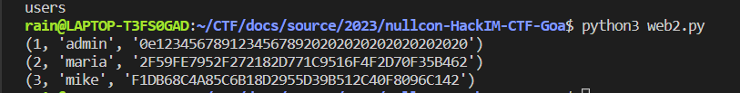

#  nullcon HackIM CTF

[nullcon HackIM CTF](https://ctf.nullcon.net/challenges)

## WEB

### Debugger

**题目描述**

My friend implemented their own PHP-Info-based debugger... and said that since only 127.0.0.1 can access it, we can ship it to production!

### TYPicalBoss

**题目描述**

My boss just implemented his first PHP website. He mentioned that he managed to calculate a hash that is equal to 0??? I suppose he is not very experienced in PHP yet.

#### 题目分析

访问 / 可以看到文件夹，然后下载出现的数据库文件。之后利用 python 读取一下该文件发现了几个用户的数据：



不过我没想明白这一串十六进制的含义是什么。。一开始根据描述我也想到的是 php 的 md5 弱比较漏洞什么的，但是试了一个没成功就放弃了，后面发现应该尝试 sha1 的，我这里没有注意到哈希值的长度，所以没有判断出来不是 md5。具体的 payload 可以参看[此处](https://github.com/swisskyrepo/PayloadsAllTheThings/tree/master/Type%20Juggling#magic-hashes)。

### IPfilter

**题目描述**

Let's ensure that only the frontend can only contact servers from the backend network, except for the one server with all our secret data!

#### 题目分析

```php
<?php
        error_reporting(0);
        function fetch_backend($ip) {
            if(is_bad_ip($ip)) {
                return "This IP is not allowed!";
            }
            return file_get_contents("http://". $ip . "/");
        }
        function is_bad_ip($ip) {
            if(!preg_match('/^\d{1,3}\.\d{1,3}\.\d{1,3}\.\d{1,3}$/', $ip)) {
                // IP must be in X.Y.Z.Q format
                return true;
            }
            $frontend = gethostbyname(gethostname());
            $backend = gethostbyname("ipfilter_backend");
            $subnet = long2ip(ip2long($frontend) & ip2long("255.255.255.0"));
            $bcast = long2ip(ip2long($frontend) | ~ip2long("255.255.255.0"));

            if(isset($_GET['debug_filter'])) {
                echo "<pre>";
                echo "IP: " . $ip . "<br>";
                echo "Frontend: " . $frontend . "<br>";
                echo "Backend: " . $backend . "<br>";
                echo "Subnet:" . $subnet . "<br>";
                echo "Broadcast:" . $bcast . "<br>";
                echo  "</pre>";
            }

            if(inet_pton($ip) < (int) inet_pton($subnet)) {
                // Do not go below the subnet!
                return true;
            }
            if(! (inet_pton($ip) < inet_pton($bcast))) {
                // Do not go above the subnet!
                return true;
            }
            if($ip == $backend) {
                // Do not allow the backend with our secrets ;-)
                return true;
            }
            return false;
        }
        if(isset($_GET['fetch_backend']) ) {
            echo fetch_backend($_GET['bip']);
        }
        if(isset($_GET['src'])) {
            highlight_file(__FILE__);
        }
        // with <3 from @gehaxelt
    ?>
```

如果通过了 ip 检查就可以 file_get_contents，这个函数不是文件包含就是 SSRF。要求访问后端的ip地址拿到 secret，但是又不允许我们直接输入后端地址。注意到它这个 ip 地址的比较是存在漏洞的，因为 192.168.100.2 和 192.168.100.02 是一样的。

[nullcon HackIM CTF Goa 2023 writeups (github.com)](https://gist.github.com/shinmai/b85b0befcb8f5871310be41efdfceea8#ipfilter)


### Colorful

**题目描述**

The world is so colorful... but can you get the flag?

#### 题目分析

打开题目拿到下面的源码：

```python
import os
import json
import secrets
from Crypto.Cipher import AES

app = Flask(__name__)

if not os.path.exists("secret"):
    with open("secret", "wb") as f:
        f.write(os.urandom(16))

app.secret_key = open("secret", "rb").read()

class SessionHandler(object):

    def __init__(self, k):
        self.k = k

    def set(self, r,p, key=None, val=None):
        session = self.get_session(r)
        if key and val:
            session[key] = val
        session = self.set_session(r, session)
        p.set_cookie("session", session, path='/')
        return session

    def set_session(self, r, s):
        c = ""
        for k in sorted(s.keys()):
            c+= f"{k}={s[k]}&"
        return self._c(c)

    def get(self, r, p):
        return self.get_session(r)

    def get_session(self, r):
        session = r.cookies.get("session", None)
        if not session:
            session = self.new_session(r)
        return self.parse(self._d(session))

    def parse(self, c):
        d = {}
        if c is None:
            return d
        for p in c.split("&"):
            try:
                k,v = p.split("=")
                if not k in d:
                    d[k]=v
            except:
                pass
        return d

    def new_session(self, r):
        id = secrets.token_hex(4)
        c = f"_id={id}&admin=0&color=ffff00&"
        return self._c(c)

    def _c(self, v):
        try:
            v = v.encode()
            while len(v) % 16 != 0:
                v += b'\x41' 
            return AES.new(self.k,1).encrypt(v).hex()
        except:
            return None

    def _d(self, v):
        try:
            return AES.new(self.k,1).decrypt(bytearray.fromhex(v)).decode()
        except:
            return None

app.session_handler = SessionHandler(app.secret_key)

@app.route("/color/<color>", methods=['POST','GET'])
def change_color(color):

    @after_this_request
    def sc(response):
        app.session_handler.set(request, response,"color",color)
        return response
    return redirect("/")

@app.route("/")
def index():
    code = open(__file__).read()
    session = app.session_handler.get(request,None)
    color = session['color']

    if session['admin'] == '1':
        return open("FLAG").read()

    @after_this_request
    def sc(response):
        app.session_handler.set(request,response)
        return response

    return f"<h1>The world is so colorful!</h1><p>Change your color at <pre>/color/$color</pre> and return here.</p><style>html {{background-color: #{color}}}</style><br><pre>{code}</pre>"

if __name__ == '__main__':
    app.run(debug=False, host='0.0.0.0')
```

从根路由可以知道需要 session['admin']==1 才可以获得 flag，session 在 cookie 里面传过去。

看了下session的更改只能改 color，咋获得 flag？
[ctf/2023-08-20-nullcon/colorful/README.md at master · Cooperw/ctf (github.com)](https://github.com/Cooperw/ctf/blob/master/2023-08-20-nullcon/colorful/README.md)

Create an additional AES-ECB block (`/color/1234&in=1&color=1234`) and replace the second one.

没太搞懂这个题目，下回再看看。

### Magic Cars

**题目描述**

Who doesn't love Magical Cars? go checkout this cool website and even upload your fav gif to support it.

#### 题目分析

一个 php 搭建的网站，看了下感觉是有限制的文件上传题目。唯一的难点可能就是后缀名得要是 gif 了，如何解决这个问题？

```
$extension = strtolower(pathinfo($target_dir,PATHINFO_EXTENSION));
```

冷知识来啦：pathinfo存在空字节截断漏洞，也就是说 xxx.php%00.jpg 会被 pathinfo 认为是 jpg 文件，但是实际上保存得时候文件后缀是 php，这就完成了截断！

详情参看：[Nullcon 2023 - Magic Cars | xHacka](https://xhacka.github.io/posts/writeup/2023/08/20/Magic-Cars/)

### Loginbytepass

**题目描述**

I wrote this ultra super secure login mechanism... but I heard rumors that my colleagues are still able to login as admin, although I ensured that SQL injection is impossible.

#### 题目分析

post 加个 src 参数看到源码如下：

```php
<?php
        define("LOADFLAG", true);
        error_reporting(0);
        $db = mysqli_connect('db', 'user', 'password', 'db');

        function list_users() {
            global $db;
            echo "<h1>Registered users:</h1>";
            $res = mysqli_query($db, "SELECT * FROM users");
            while($user = $res->fetch_object()) {
                echo "<p>";
                echo "User: " . $user->username . " Password: " . $user->password;
                echo "</p>";
            }
        }
        function check_auth($username, $password) {
            global $db;
            $username = mysqli_real_escape_string($db, $username); // prevent SQL injection
            $password = md5(md5($password, true), true);
            $res = mysqli_query($db, "SELECT * FROM users WHERE username = '$username' AND password = '$password'");
            if(isset($res) && $res->fetch_object()) {
                return true;
            }
            return false;
        }

        if(check_auth($_POST['username'], $_POST['password'])) {
            include_once "flag.php";
        }
        list_users();

        if(isset($_GET['src'])) {
            highlight_file(__FILE__);
        }
        // with <3 from @gehaxelt
    ?>
```

很难搞，一次 md5的利用 ffifdyop 可以绕过，但是两次 md5 怎么办呢？能不能找到这样一个字符串，两次md5后的效果和 ffifdyop 一次 md5 一样呢？

